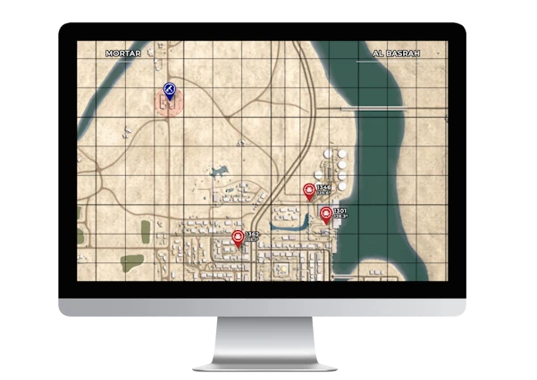
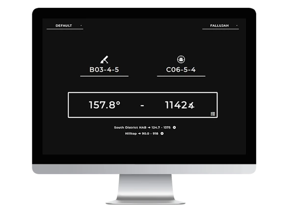
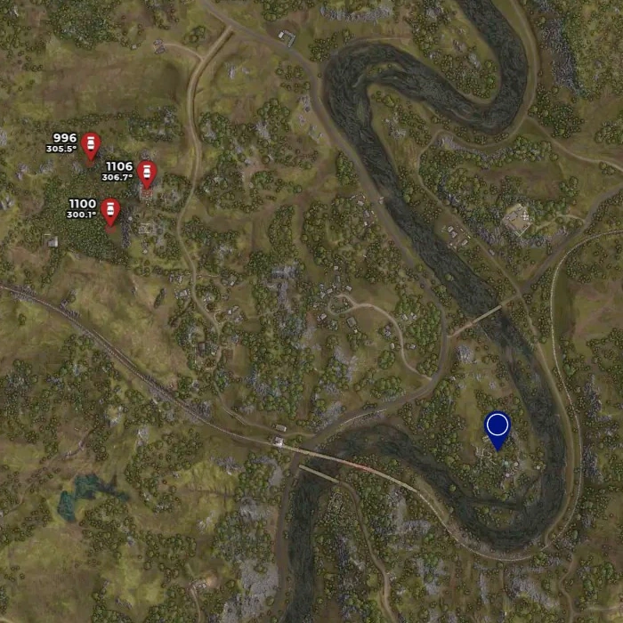
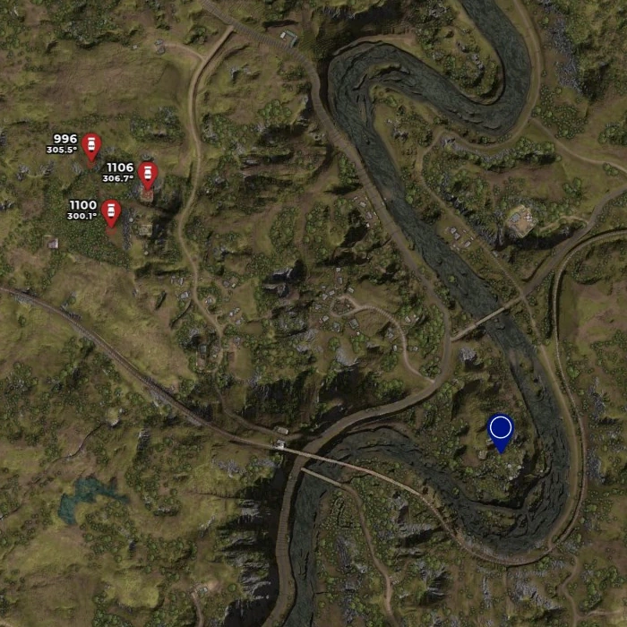
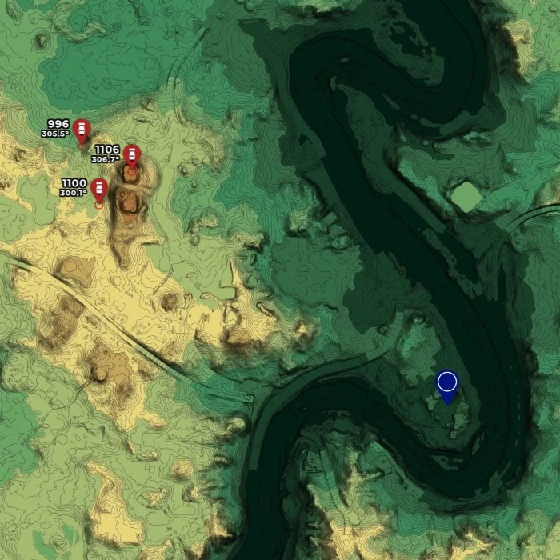

<h1 align="center">
    
</h1>

      
     

    <a href="https://github.com/sh4rkman/SquadCalc/issues/new">🪳 Report a Bug</a> &nbsp;&bull;&nbsp;
    <a href="https://github.com/sh4rkman/SquadCalc/wiki/Translating-SquadCalc"> 📜 Help to Translate</a> &nbsp;&bull;&nbsp;
    <a href="https://github.com/sh4rkman/SquadCalc/wiki">📖 Wiki</a> &nbsp;&bull;&nbsp;
    <a href="https://github.com/sh4rkman/SquadCalc/blob/master/CHANGELOG.md">🆕 ChangeLog</a>

 
 

# Introduction

 

[squadcalc.app](https://squadcalc.app/) is a mortar calculator designed specifically for the game <a href="https://joinsquad.com/">Squad</a>.  
This tool facilitates rapid mortar calculations through two distinct modes:
1. **Interactive Map Mode:** This mode enables users to intuitively add visual targets by double-clicking on the map, allowing easy manipulation of weapons and targets through drag-and-drop functionality.

2. **Simple Legacy Mode:** For a straightforward approach, the legacy mode allows users to swiftly enter keypad inputs without the complexity of maps, buttons, or icons.
 

 
 
# **Screenshots**

 

  

# **Features**

## **Elevations Calculations**

SquadCalc utilizes heightmaps extracted from the Squad SDK to precisely compute the elevation difference between mortars and targets, automatically adjusting the elevation settings. 

## **Map Layers**

### Base map :
The classic, straight from the game base map.  

<picture>
  
</picture>

### Terrain map :
Base map enhanced with bumpmap from SDK's heightmap. Add a better comprehension of terrain.  
Also known as "why the fuck is it not the default ingame map?"

<picture>
  
</picture>

### Topographic map :
A mix of bump map, contour map with a touch of hypsometric colors for a complete understanding of map reliefs.

<picture>
  
</picture>

## **Advanced informations & Simulation**

Get a better and complete understanding of your shots and visualise a simulation of the projectile path and the terrain between you and your targets. 
You can even see if terrain is going to block your projectiles when using low angle weapons ! (UB/GRAD) 

<picture>
  
</picture>

<picture>
  
</picture>

## **Advanced customisation**

Want to see Spread radius, time of flight, distance AND bearing for each targets ? You can.  
Rather have a minimalist/non-clustered map ? you can too. Hop in settings to customise everything.

<picture>
    
</picture>

  

# **Map & Weapons Support**

|                                   |       **WEAPONS**     |                                                    |
|-------------------------------------------------------------------|-----------------------|--------------------|
|                 | Mortars               |        ✅          |
|        | UB-32                 |        ✅          |
|       | Hell Canon            |        ✅          |
| | Technicals mortars    |        ✅          |
|             | Technicals/BRDM UB-32 |        ✅          |
|             | BM-21 Grad            |        ✅          |
|           | M1064-A3 120mm        |        ✅          |

| **MAPS**                    |                     |
|-----------------------------|---------------------|
| Al Basrah                   |         ✅          |
| Anvil                       |         ✅          |
| Belaya                      |         ✅          |
| Black Coast                 |         ✅          |
| Chora                       |         ✅          |
| Fallujah                    |         ✅          |
| Fool's Road                 |         ✅          |
| Goose Bay                   |         ✅          |
| Gorodok                     |         ✅          |
| Harju                       |         ✅          |
| Jensen's Range              |         ✅          |
| Kamdesh Highlands           |         ✅          |
| Kohat Toi                   |         ✅          |
| Kokan                       |         ✅          |
| Lashkar Valley              |         ✅          |
| Logar Valley                |         ✅          |
| Manicouagan                 |         ✅          |
| Mestia                      |         ✅          |
| Mutaha                      |         ✅          |
| Narva                       |         ✅          |
| Narva (flooded)             |         ❌          |
| Pacific Proving Grounds     |         ❌          |
| Sanxian Islands             |         ✅          |
| Skorpo                      |         ✅          |
| Sumari Bala                 |         ✅          |
| Tallil Outskirts            |         ✅          |
| Yehorivka                   |         ✅          |