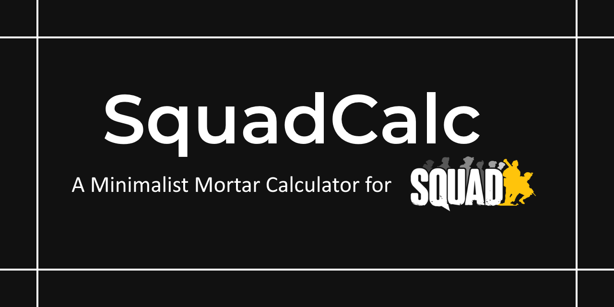
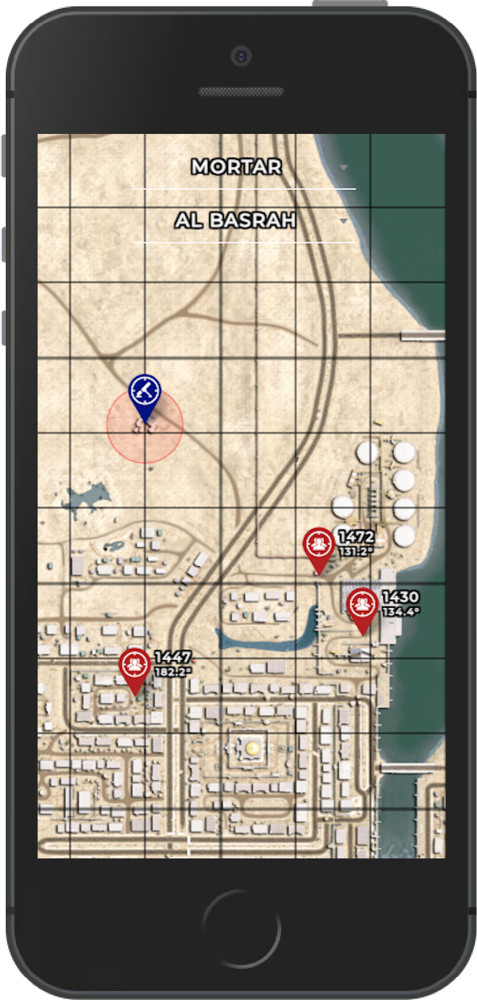
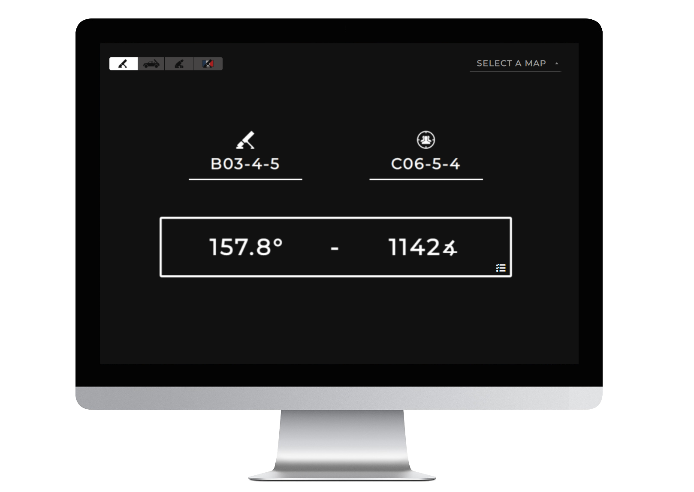
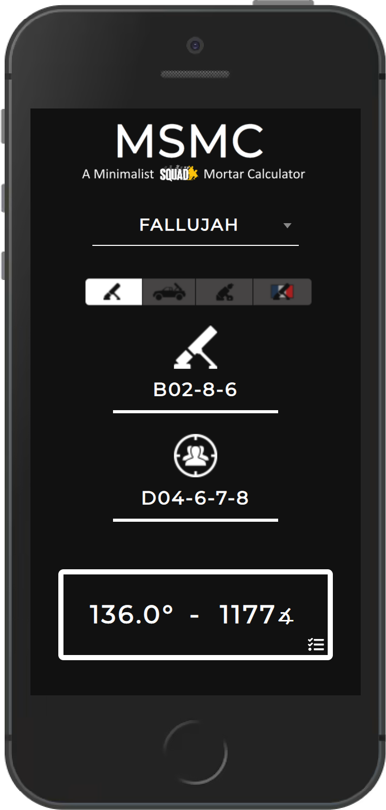

<p align="center">
  
</p>


<p align="center">
  <a href="https://github.com/sh4rkman/SquadCalc/blob/master/LICENSE"></a>
  <a href="https://validator.w3.org/nu/?doc=https%3A%2F%2Fsquadcalc.app%2F"></a>
  <a href="https://deepscan.io/dashboard#view=project&tid=12376&pid=25781&bid=811276"></a>
  <a href="https://www.codefactor.io/repository/github/sh4rkman/squadcalc"></a>
</p>

</br>
</br>


# Introduction


</br>


Squadcalc.app is a mortar calculator designed specifically for the game <a href="https://joinsquad.com/">Squad</a>.  
This tool facilitates rapid mortar calculations through two distinct modes:
1. **Interactive Map Mode:** This mode enables users to intuitively add visual targets by double-clicking on the map, allowing easy manipulation of weapons and targets through drag-and-drop functionality.

2. **Simple Legacy Mode:** For a straightforward approach, the legacy mode allows users to swiftly enter keypad inputs without the complexity of maps, buttons, or icons.
 


</br>
 
# **Screenshots**

</br>

 <p align="center">
  
  
</p>
 
<p align="center">
  
  
</p>


</br></br>

# **Features**


### **Elevations Calculations**

SquadCalc utilizes heightmaps extracted from the Squad SDK to precisely compute the elevation difference between mortars and targets, automatically adjusting the elevation settings. 


### **Map & Weapons Support**


| **Weapons**      |           |
|-----------------------|--------------------|
| Mortars               |        ✅          |
| UB-32                 |          ✅        |
| Hell Canon            |           ✅       |
| Technicals mortars    |        ✅            |
| Technicals/BRDM UB-32 |      ✅              |
| BM-21 Grad            |      ✅             |


| **Maps**                     |                |
|-----------------------------|----------------|
| Al Basrah                   |        ✅           |
| Anvil                       |        ✅           |
| Belaya                      |       ✅               |
| Black Coast                 |        ✅           |
| Chora                       |       ✅            |
| Fallujah                    |      ✅             |
| Fool's Road                 |       ✅            |
| Goose Bay                   |       ✅            |
| Gorodok                     |        ✅           |
| Harju                       |         ✅          |
| Jensen's Range              |            ❌       |
| Kamdesh Highlands           |         ✅          |
| Kohat Toi                   |         ✅          |
| Kokan                       |        ✅           |
| Lashkar Valley              |         ✅          |
| Logar Valley                |        ✅           |
| Manicouagan                 |        ✅           |
| Mestia                      |         ✅          |
| Mutaha                      |        ✅           |
| Narva                       |          ✅         |
| Pacific Proving Grounds     |         ❌          |
| Sanxian Islands             |      WIP             |
| Skorpo                      |        ✅           |
| Sumari Bala                 |      ✅             |
| Tallil Outskirts            |       ✅            |
| Yehorivka                   |       ✅            |


</br></br>

# Installation
</br>


## Clone and install

```
git clone https://github.com/sh4rkman/SquadCalc.git
cd SquadCalc
npm ci
```

## Running a development local server
```
npm run start
```

## Building production bundle
</br>

for a preprod environnement (robots.txt disallow all):
```
npm run build:dev
```
</br>

for a final production environnement :
```
npm run build:prod
```

</br></br>


# Thanks

This project is **largely** inspired by the work of Endebert on <a href="https://github.com/Endebert/squadmc">SquadMC</a>.  
I wanted a lighter alternative to this great tool, some could say this project is just a new interface to squadmc calculation code.
