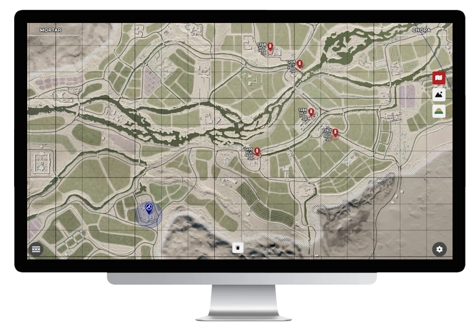
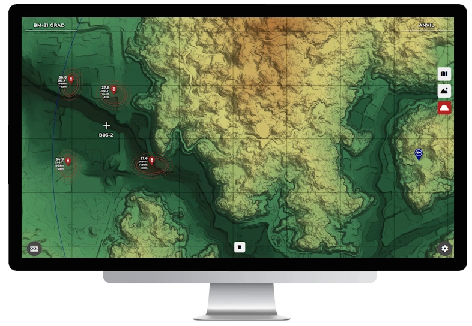
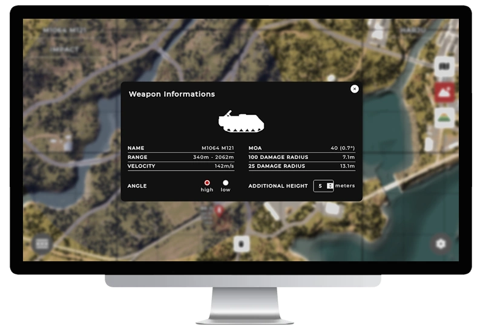
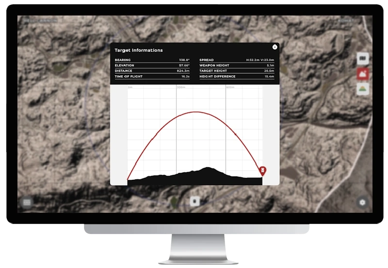
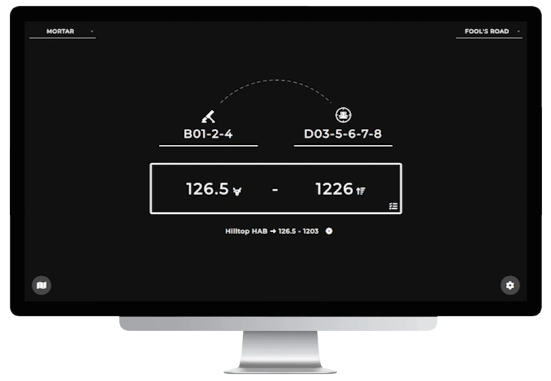
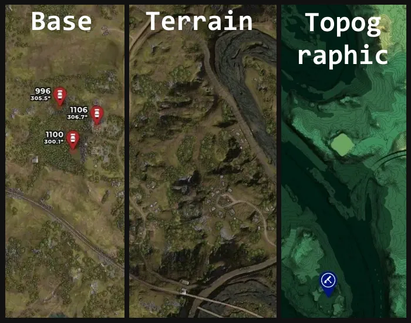
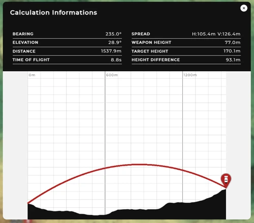
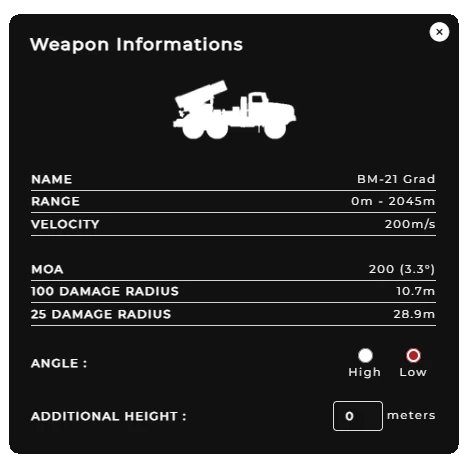
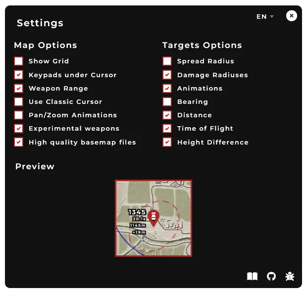

<h1 align="center">
    
</h1>

    
    
    

    <a href="https://github.com/sh4rkman/SquadCalc/issues/new">🪳 Report a Bug</a> &nbsp;&bull;&nbsp;
    <a href="https://github.com/sh4rkman/SquadCalc/wiki/Translating-SquadCalc"> 📜 Help to Translate</a> &nbsp;&bull;&nbsp;
    <a href="https://github.com/sh4rkman/SquadCalc/wiki">📖 Wiki</a> &nbsp;&bull;&nbsp;
    <a href="https://github.com/sh4rkman/SquadCalc/blob/master/CHANGELOG.md">🆕 ChangeLog</a>

 
 

[squadcalc.app](https://squadcalc.app/) is a mortar *(and more)* calculator designed for the game <a href="https://joinsquad.com/">Squad</a> !  

 
 

# 
Table of Contents

1. [Screenshots](#screenshots)
2. [Features](#features)
   - [Elevations Calculations](#elevations-calculations)
   - [Map Layers](#map-layers)
   - [Commonly Used Spot](#commonly-used-spot)
   - [Advanced Information & Simulation](#advanced-informations--simulation)
   - [Advanced Customisation](#advanced-customisation)
3. [Squad Mortar Overlay Compatibility](#squad-mortar-overlay-compatibility)
4. [Map & Weapons Support](#map--weapons-support)

 
 
# 
Screenshots

 

  
  
  
  
  

  

# 
Features

## **Elevations Calculations**

SquadCalc utilizes heightmaps extracted from the Squad SDK to precisely compute the elevation difference between mortars and targets, automatically adjusting the elevation settings. [Check out the Wiki](https://github.com/sh4rkman/SquadCalc/wiki/Deducing-Altitude) to understand how it works.

## **Map Layers**

  <picture>
    
  </picture>

### Base map :
The classic, straight from the game base map.  
Also avaiblable in AI Upscaled 8192x8192 pixels though the Settings. 

### Terrain map :
Base map enhanced with bumpmap from SDK's heightmap. Add a better comprehension of terrain.  
Also known as "why the fuck is it not the default ingame map?"

### Topographic map :
A mix of bump map, contour map with a touch of hypsometric colors for a complete understanding of map reliefs.

## **Commonly used spot**

If you're having trouble finding a good spot to place your mortar or weapons, activate the 'Frequent Locations' feature to see where other players commonly set theirs!

  <picture>
    
  </picture>

## **Advanced informations & Simulation**

Get a better and complete understanding of your shots and visualise a simulation of the projectile path and the terrain between you and your targets. 
You can even see if terrain is going to block your projectiles when using low angle weapons ! (UB/GRAD) 

  <picture>
    
  </picture>
  <picture>
    
  </picture>

## **Advanced customisation**

Want to see Spread radius, time of flight, distance AND bearing for each targets ? You can.  
Rather have a minimalist/non-clustered map ? you can too. Hop in settings to customise everything.

  <picture>
      
  </picture>

  
# 
Squad Mortar Overlay Compatibility

SquadCalc is compatible with [Squad Mortar Overlay](https://github.com/Devil4ngle/SquadMortarOverlay), made by [Devil4ngle](https://github.com/Devil4ngle).  
Squad Mortar Overlay is a program capturing screenshots from your ingame map and overlaying it with SquadCalc.  

It allows :
* Having ingame markers automatically merged into SquadCalc map to quickly place the right targets
* Having an ingame overlay with the current SquadCalc calculations displayed in front of Squad

  <picture>
      
  </picture>

  

# 
Map & Weapons Support

|                                   |       **SUPPORTED WEAPONS**   |                                            |
|-------------------------------------------------------------------|-------------------------|------------------|
|                 | Mortars                 |     ✅          |
|        | UB-32                   |     ✅          |
|       | Hell Canon              |     ✅          |
| | Technicals mortars      |     ✅          |
|             | Technicals/BRDM UB-32   |     ✅          |
|             | BM-21 Grad              |     ✅          |
|           | M1064-A3 120mm          |     ✅          |
|         | MK-19 RWS (Experimental)|     ✅          |

|     |         **SUPPORTED MAPS**            |
|-----------------------------|---------------------|
| ✅ | Al Basrah, Anvil, Anvil, Belaya, Black Coast, Chora, Fallujah, Fool's Road, Goose Bay, Gorodok, Gorodok, Harju, Jensen's Range, Kamdesh Highlands, Kohat Toi, Kokan, Lashkar Valley, Logar Valley, Manicouagan, Mestia, Mutaha, Narva, Sanxian Islands, Skorpo, Sumari Bala, Tallil Outskirts, Yehorivka       |
| ❌ | Narva (flooded), Pacific Proving Grounds    |          