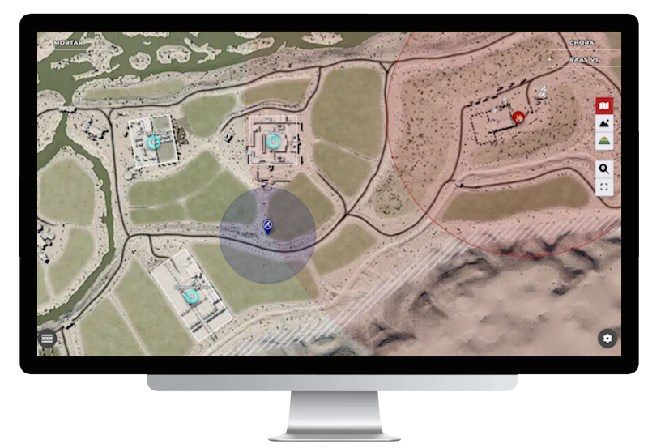
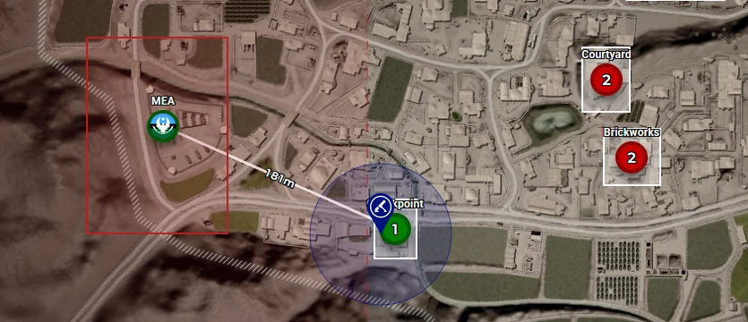
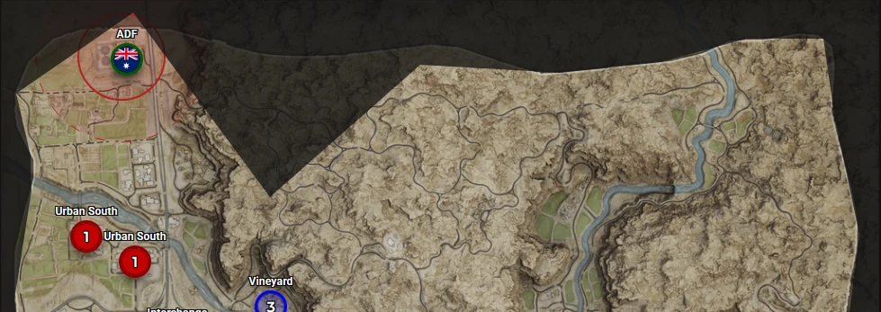
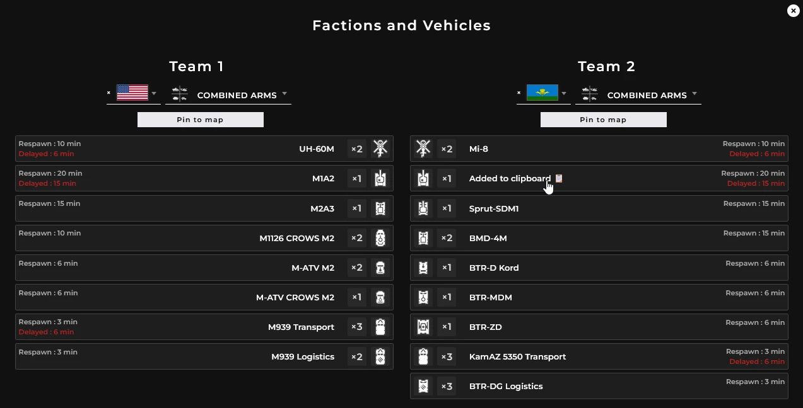
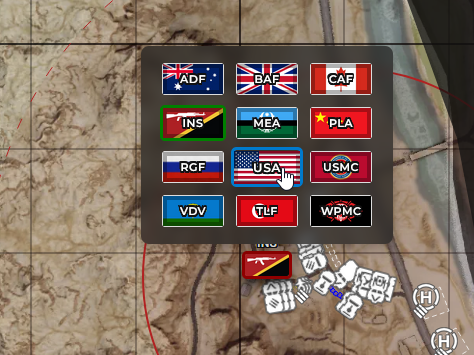
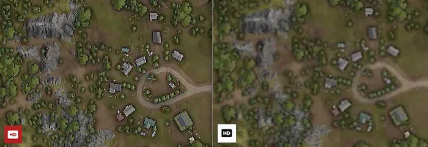

<h1 align="center">
    
</h1>

    
    
    
      

 
 

[SquadCalc.app](https://squadcalc.app/) – The Ultimate In-Game Companion for [Squad](https://joinsquad.com/)!

 
 
 
# <b>Screenshots</b>

  
<a>Click to Unfold</a>

  

    <picture></picture>  
    <picture></picture>
    <picture></picture>
    <picture></picture>
    <picture></picture>
    <picture></picture>
    <!-- <picture></picture> -->
  

 

# <b>Features</b>

## Mortar Calculator

  
<b>Elevations Calculations</b>

   
  SquadCalc utilizes heightmaps extracted from the Squad SDK to precisely compute the elevation difference between mortars and targets, automatically adjusting the elevation settings.  
  
   

  [Check out the Wiki](https://github.com/sh4rkman/SquadCalc/wiki/Deducing-Altitude) to understand how it works.

   

  
<b>Spread and Damages radiuses</b>
  
   
  Reduce teamkilling and maximize your damage by visualizing the spread of your shells and the range of their explosions.  

  Check out the Wiki on [Spread](https://github.com/sh4rkman/SquadCalc/wiki/Deducing-Spread) and [Damage](https://github.com/sh4rkman/SquadCalc/wiki/Deducing-Damage-Radius) to understand how it works.

  

    
  

   

  
<b>Commonly used spot</b>

   
  Squadcalc is logging up to 15000 weapon positions for each map and each weapons, thus allowing to create a dynamic heatmap of where other players commonly set their weapons. If you're having trouble finding a good spot to place your mortar or weapons, activate the 'Frequent Locations' feature !  

   
  

    
  

   

  
<b>Squad Mortar Overlay Compatibility</b>

     

  SquadCalc is compatible with [Squad Mortar Overlay](https://github.com/Devil4ngle/SquadMortarOverlay), made by [Devil4ngle](https://github.com/Devil4ngle).  
  Squad Mortar Overlay is a program capturing screenshots from your ingame map and overlaying it with SquadCalc.  

  It allows :
  * Having ingame markers automatically merged into SquadCalc map to quickly place the right targets
  * Having an ingame overlay with the current SquadCalc calculations displayed in front of Squad

   

  ### 
[> Download Squad Mortar Overlay <](https://github.com/Devil4ngle/SquadMortarOverlay/releases)

 

## Layer Info

  
<b>Lanes/Flags preview</b>

   

  Hover over a flag to preview how selecting it would affect the layer.  
  This allows you to quickly scan how the layer looks at the start of the game, for example.

  

    <picture></picture>
  
 

  
<b>Capzones</b>

   

  SquadCalc lets you see each precise flag capzone extracted from the game SDK and view it in detail.  
  It helps you find the perfect location for a FOB, the best route to sneak into a cap zone, or even where to fire mortars effectively.

  

    <picture></picture>
  
 

  
<b>Main Protection & No-deploy zone</b>

   

  Plan your radios and mortars : squadcalc display every mains protection zones (no vehicles shooting) and no-deploy (radios, mortars, emplacement).

  

    <picture></picture>
  
 

  
<b>Real map borders</b>

     

  Each layer can have have it's own playable aera : squadcalc shows the exact invisible map limits.  

  

    <picture></picture>
  
 

  
<b>Autocomplete</b>

     

  SquadCalc will automatically complete the layer if there is only one possible incoming flag, saving you a few clicks.

  
<b>Factions, Units and Vehicles list</b>

     

  Browse every layer available factions, units, and vehicles :

  

    <picture></picture>
  
 

  You can also pin the enemy vehicles list to your map and set timers when you destroy them : you will receive a sound notification when they respawn !

  

    <picture></picture>
  
 

  Change faction and pick a unit directly from the map by rightclicking a main :

  

    <picture></picture>
  
 

  
<b>Vehicles Spawns Locations</b>

     

  Anticipate where the vehicles will be spawning :

  

    <picture></picture>
  
 

 

## Others

  
<b>Shared Sessions</b>

   

  Start a shared session and invite your friends!  

  Collaborate on a single map, sharing markers, weapons, and targets in real time.
  Synchronize your mortar targets more efficiently, strategize together, and develop tactics seamlessly.

  Sessions works up to 10 participants.

  

    <picture></picture>
  

  

  
<b>Advanced Customisation & Informations</b>

   

  Want to see Spread radius, time of flight, distance AND bearing for each targets ? You can.  
  Rather have a minimalist/non-clustered map ? you can too. Hop in settings to customise everything.

  Get a better and complete understanding of your shots and visualise a simulation of the projectile path and the terrain between you and your targets. You can even see if terrain is going to block your projectiles when using low angle weapons ! (UB/GRAD) 

  

    <picture>
        
    </picture>
      <picture>
      
    </picture>
    <picture>
      
    </picture>
  

  
<b>Map Layers</b>

   

  

    <picture></picture>
  

  ### Base map :
  The classic, straight from the game base map.  

  ### Terrain map :
  Base map enhanced with bumpmap from SDK's heightmap. Add a better comprehension of terrain.  
  Also known as "why the fuck is it not the default ingame map?"

  ### Topographic map :
  A mix of bump map, contour map with a touch of hypsometric colors for a complete understanding of map reliefs.

  
<b>Ultra HD Maps</b>

   

  

    <picture></picture>
    
UHD Maps vs regular ingame map image

  

   

  With a single click, you can switch the map to a high-definition version powered by AI upscaling. The HD maps are 8192×8192 resolution images, letting you explore every part of the map in ultra-sharp detail right within the Leaflet interface.

  
<b>Import/Export Your Maps</b>

   

   

  

    <picture></picture>
  

   

  Easily export your map and markers to an offline file for backup or sharing. To restore them later, just drag and drop the file into SquadCalc—your markers will be instantly loaded. These files are also perfect for sharing with teammates to ensure everyone’s on the same page.

   
# **Attributions**
 

* 🗺️ Map System built on **[Leaflet JS](https://leafletjs.com/)**
* 🖼️ Map Images, Marker Icons are from SquadSDK by **[OffWorld Industries](https://www.offworldindustries.com/)**
* 🧮 Layers & Factions Data are extracted thanks to **[Squad-Wiki Pipeline Map Data](https://github.com/Squad-Wiki/squad-wiki-pipeline-map-data)** SDK extractor tools *(Special thanks to [Shanomac99](https://github.com/Shanomac99))*
* 🗣️ AI Text-To-Speech made with **[Luvvoice](https://luvvoice.com/)** 
* 🔣 Icons by **[FontAwesome](https://fontawesome.com/icons)**
* 👌🏼 Thanks to everyone supporting the project with kinds words, clever suggestions, and better code than mine
  * MK19 implementation by [Ferrariic](https://github.com/Ferrariic)
  * SquadMortarOverlay connector by [Devil4ngle](https://github.com/Devil4ngle)
  * Weapon-to-Target lines & deviation grid enhancements by [Antiaris74](https://github.com/Antiaris74)  
  * Compact elevation by [d503-ai](https://github.com/d503-ai)  
  * ZH Translations by [Guducat](https://github.com/Guducat)
  * RU Translations by sitroz
  * GE Translations by [f0xcb](https://github.com/f0xcb) 

   
# **Support the project**
 

  

