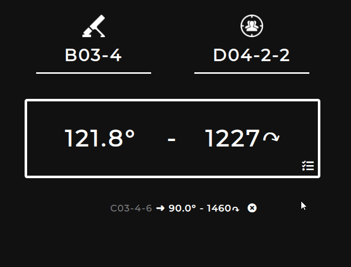

 <p align="center">
   
 </p>

<p align="center">


</p>

<p align="center">
  <a href="https://github.com/sh4rkman/SquadCalc/blob/master/LICENSE"></a>
</p>
<p align="center">
  <a href="https://validator.w3.org/nu/?doc=https%3A%2F%2Fsquadcalc.app%2F"></a>
  <a href="https://deepscan.io/dashboard#view=project&tid=12376&pid=15404&bid=306486"></a>
  <a href="https://www.codefactor.io/repository/github/sh4rkman/squadcalc"></a>
</p>

</br>
</br>
</br>
<p align="center">
    
</p>

</br>
</br>
</br>

# SquadCalc


</br>

**SquadCalc** is a simple, easy on the eyes mortar calculator for <a href="https://joinsquad.com/">Squad</a>.  
It allows quick mortars calculations without fancy map, buttons and icons.
 
</br>

Select a map, enter locations, shoot.

</br>
 
 
<p align="center">
  
  
</p>

# **Features**


## **Elevations Calculations**

SquadCalc is using heightmaps from Squad SDK to calculate the height difference between mortars and targets and ajust automatically the elevation.  
If your target is up a hill, SquadCalc will make sure you don't waste 1000 ammo points 20 meters off that enemy HAB.

Heightmaps are hidden : simply pick your map from the list and shoot.

</br>

<p align="center">
  
  
</p>
<p align="center"><sub><sup>Examples of Heightmaps used for caculations (Gorodok & Tallil)</sub></sup></p>

</br>

## **Different Weapons Support**

</br>


SquadCalc support different type of mortars :
- Classics mortars
- Technicals mortars
- Hell Canon (Insurgents)
- BM-21 Grad (Milice)
- Long range (3000m) 120mm mortars from the <a href="https://smf.tactical-collective.com/">French Mod</a>

</br>

</br></br>


## **Calculation Saving**

</br>

Save up to four calcs for later :

 </br>

 <p align="center">
   
 </p>

 </br></br>

# Installation
</br>


## Clone and install

```
git clone https://github.com/sh4rkman/SquadCalc.git
cd SquadCalc
npm ci
```

## Running a development local server
```
npm run start
```

## Building production bundle
```
npm run build
```

</br></br>


# Thanks

This project is **largely** inspired by the work of Endebert on <a href="https://github.com/Endebert/squadmc">SquadMC</a>.  
I wanted a lighter alternative to this great tool, some could say this project is just a new interface to squadmc calculation code.


